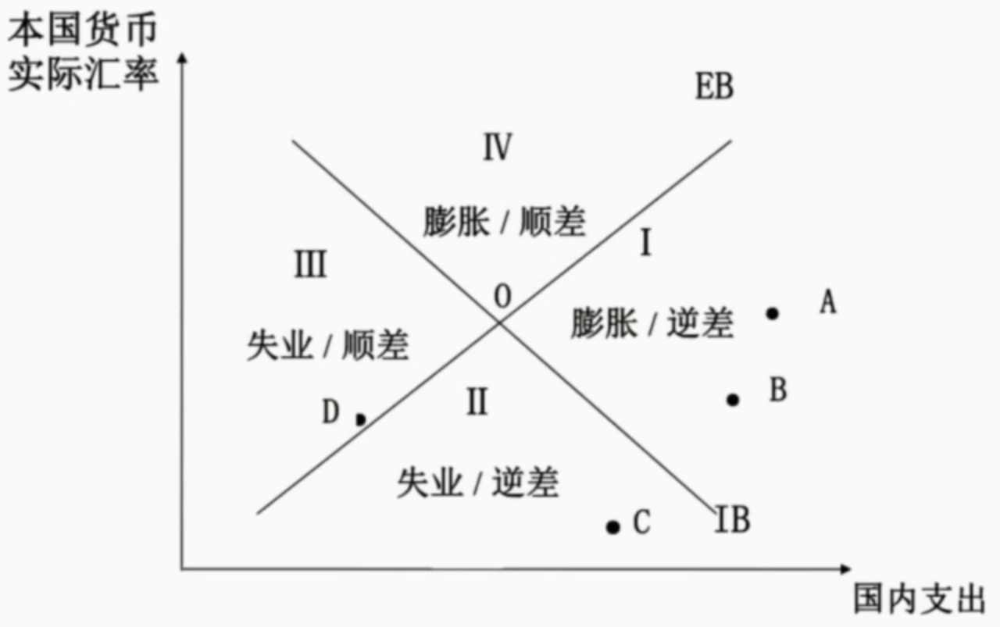
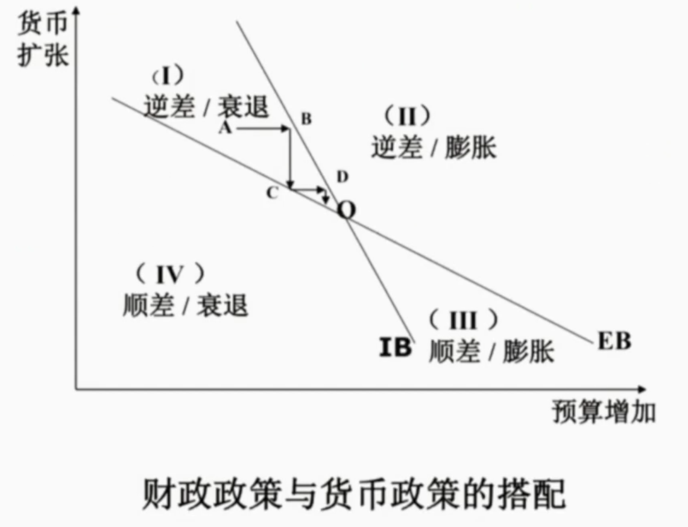
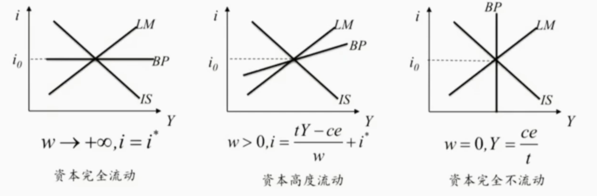
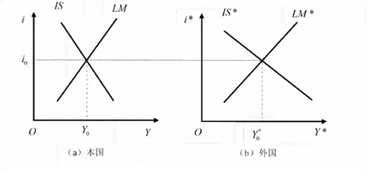

- 内外均衡及其调节
  background-color:: #978626
	- 内部均衡：
	  国内总供给等于总需求AS=AD
	  短期内假设总供给不变，总需求的变动只引起价格的变动，不会引起产出的变动
	- 外部均衡：
	  国际收支帐户在一定口径上的数量平衡
	  在内部均衡实现的基础上
	- 冲突：
	  封闭经济下，宏观经济主要目标本身就存在冲突（经济增长、稳定就业、稳定物价）
	  开放经济下，宏观经济在封闭经济下的主要目标与国际收支之间产生新的冲突
	- 米德冲突
	  background-color:: #533e7d
	  固定汇率制下内部均衡和外部平衡的冲突问题。在固定汇率制下（支出转换型不能用），政府只能主要运用改变总需求的政策调节内外均衡
	  此时若经济衰退同时国际收支逆差/通胀同时国际收支顺差，会导致冲突
	- 数量匹配原则（丁伯根原则）：
	  background-color:: #533e7d
	  实现N个独立的政策目标，至少需要相互独立的N个有效的政策工具
	- 最优指派原则（有效市场分类原则）：
	  background-color:: #533e7d
	  蒙代尔：每一目标应当指派给对这一目标有着相对最大影响力，有相对优势的工具
	  【货币政策对外，财政政策对内，相互协调】
	- 斯旺模型：
	  background-color:: #533e7d
	  collapsed:: true
		- 
		- IB线：内部均衡，总供给等于总需求，总供给水平一定
		  * AS=AD=C+I+G+EX=国内支出+净出口，汇率上升，净出口增加，国内支出减少
		  * IB线右方：国内支出过多，通货膨胀；左方通缩（失业）
		- EB线：外部均衡，净出口为零
		  * 本币贬值，净出口增加，顺差，为解决顺差问题需要扩大国内支出
		  * EB线以上国内支出不足（贬值过度），顺差；下方逆差
		- 支出增减政策紧缩/扩张解决通胀/通缩问题；支出转换政策贬值/升值解决顺差/逆差问题
	- 蒙代尔模型
	  background-color:: #533e7d
	  collapsed:: true
		- 
		- 纵轴货币政策，横轴财政政策。
		- 财政政策对内部均衡更有效，货币政策对外部均衡更有效（最优指派原则）
		- IB左边需求不足，经济衰退；IB右边通胀
		- EB右边需求过度，增加进口满足需求，国际收支逆差
		- > 注意：蒙代尔模型不涉及支出转换型政策！【相当于固定汇率制下】
	- 蒙代尔-弗莱明模型
	  background-color:: #533e7d
	  collapsed:: true
		- $$IS: Y=(a-bi)+(ce-tY), b>0,c>0,0<t<1$$
		- $$LM: M_s=p(kY-hi),k>0,h>0$$
		- $$BP: (ce-tY)+w(i-i^*)=0$$
		- 
		- 移动方向：
		  * IS：财政政策扩张或本币贬值（e上升），右移
		  * LM：货币供应量增加（扩张），右移
		  * BP：本币贬值（e上升），右移
		- 浮动汇率制下LM不动；固定汇率制下LM移动
		- > 三元悖论：一国汇率的稳定性、资本自由流动性和货币政策有效性这三个目标不能同时实现，最多只能同时满足两个目标
		  中国选择了稳定的汇率制度和独立的货币政策；
		  美国选择了资金自由流动和独立的货币政策
	- 两国蒙代尔弗莱明模型（小型开放经济）
	  background-color:: #533e7d
		- 假设：只存在两个相同规模的国家相互影响
		- 假设：资本自由流动（外部平衡条件两国利率一致，省略BP曲线）
		- 
		- 研究重点：本国变量对外国的溢出效应（不考虑外国对本国的反馈效应）
		- 固定汇率制，货币政策传导【固定汇率制下没有相对价格机制】
		  background-color:: #793e3e
			- 
			- 本国货币供应量增加，LM右移
				- 收入机制：本国收入增加，进口增加，外国出口增加，外国IS右移
				- 利率机制：本国利率下降，资本外流本币贬值，外币升值。固定汇率制下本国收缩货币LM左移一点 ；外国扩张货币LM右移。（注意：本国LM左移会导致本国Y下降，本国进口下降，外国IS左移一点）
		- 固定汇率制，财政政策传导
		  background-color:: #793e3e
			- 图【两国MF模型不建议画图】
			- 财政政策扩张，IS右移
				- 收入机制：本国收入增加，进口增加，外国出口增加，外国IS右移
				- 利率机制：本国利率上升，本币升值倾向，扩张的货币政策，LM右移；外国利率下降，外币贬值倾向，紧缩的货币政策，LM左移（注意：LM右移会导致本国Y上升，本国进口上升，外国IS右移一点）
		- 浮动汇率制，货币政策传导【**以邻为壑**】
		  background-color:: #793e3e
			- 货币供应量增加，LM右移
				- 收入机制：本国收入增加，外国IS右移
				- 利率机制：本国利率下降，本币贬值倾向，LM不动，所以本国IS右移，外国IS左移很多【两国模型中，由于本国维持固定汇率和资本完全流动，外国财政扩张所引起的外国均衡收入水平提高，事实上是以本国均衡收入下降为代价的。】
		- 浮动汇率制，财政政策传导
		  background-color:: #793e3e
			- 财政政策扩张，IS右移
				- 收入机制：本国收入增加，进口增加，外国出口增加，外国IS右移
				- 利率机制，：本国利率上升，本币升值倾向，LM不动，本国IS左移；外国贬值倾向，外国IS再次右移
- 内外均衡理论
  background-color:: #978626