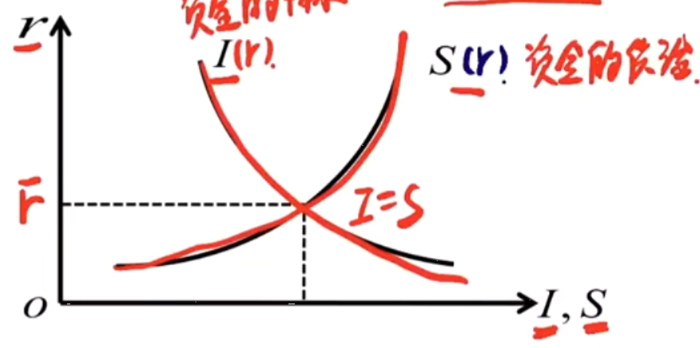
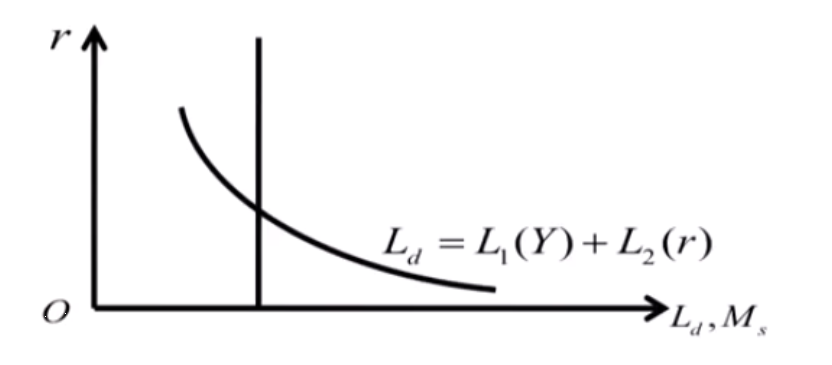
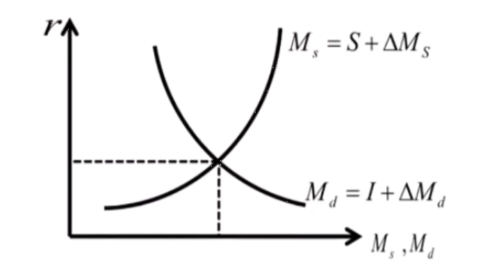
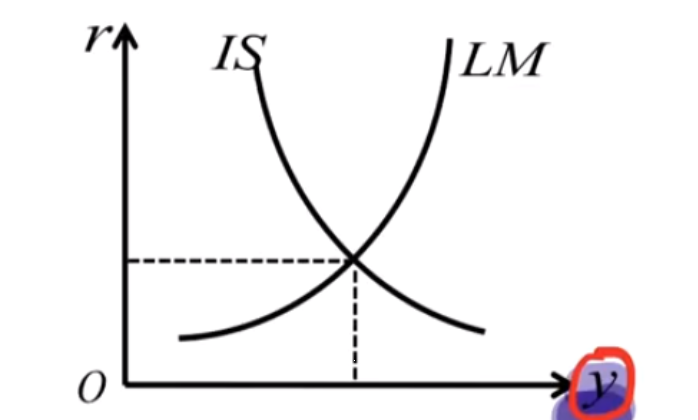
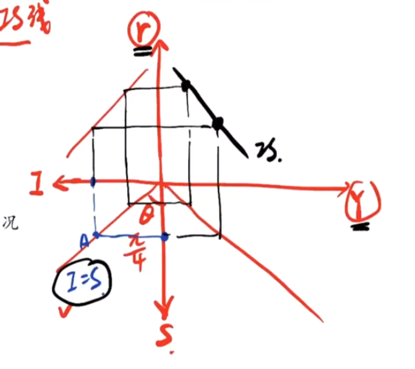

- 利率基础
  background-color:: #978626
	- [[信用]]
	  background-color:: #533e7d
	- 利息本质
	  background-color:: #533e7d
	  collapsed:: true
		- 古典经济学
			- 利息报酬说：承担风险得到的报酬/给自己带来不方便的报酬
			- 资本租金论：类似地租、房租
			- 利息源于利润：贷出的是资本的使用价值（生产利润的能力）
			- 剩余价值说：将租金和利润说结合（取决于借来消费还是生产）
		- 近代西方经济学利息本质理论
			- 节欲论：资本家放弃个人消费，节欲的结果
			- 边际生产力：利息取决于边际生产力的大小
			- 人性不耐说：有耐心者向外放款，无耐心者则借款，利息是不耐的指标
			- 流动性偏好说：一定时期内，放弃周转流动性的报酬
		- 马克思的利息本质
			- 货币转化为货币资本是利息的前提；利息属于剩余价值；利息是职能资本家让渡给借贷资本家的那一部分剩余价值
			- 利润率决定利息率。平均利润率有下降的趋势。利息率的高低取决于两类资本家对利润的分割的效果
	- 利率的分类
	  background-color:: #533e7d
		- 按时间：年利率、月利率、日利率
		- 固定利率、浮动利率
		- 名义利率、实际利率
		- 市场利率、官定利率、公定利率
		- 长期利率、短期利率
		- 一般利率、优惠利率
	- 利率计算方式
	  collapsed:: true
	  background-color:: #533e7d
		- > 1BP：1基点=0.01%
		- 实际利率、名义利率：
			- $i_r=i-\pi^e$ 
			  r名=r实+通胀
			- > 名义量VS实际量
			  
			  > 			* GDP和GNP：GDP按地域来分，GNP按国民来分。
			  			* 名义GDP-（当前时刻）100鸡蛋  2元/个=200元
			  
			  > 实际GDP-（不变价【基期】）1元/个
			  【中国的GDP绝对量是名义量，增速是实际量】
		- 单利： $$FV=PV\times(1+i\times n)$$
		- 复利： $$FV=PV\times (1+i)^n$$
		- 多次计息： $$FV=PV\times(1+\frac rm)^{mn}$$
		- 连续复利： $$FV=\lim_{m\to\infty}PV(1+\frac rm)^{mn}=PV\times e^{nr}$$
		- 有效年利率： $$(1+r/m)^{m}=1+r^*$$
		- 年金
			- 永续年金
			- 永续增长年金
			- 增长年金
		- 等额本金：每月还款数量一致
		  等额本息：每月需要还的本金一样，特点是还款会逐月减少
	- 货币的时间价值——常见年金
	  background-color:: #533e7d
	- 利率的作用（简答题）
	  background-color:: #533e7d
	  collapsed:: true
		- 杠杆效应
			- 宏观角度
				- 积累资金；调整信用规模；调节国民经济结构；抑制通胀；平衡国际收支
			- 微观角度
				- 激励企业提高资金使用效率；影响家庭和个人的家庭资产投资；作为租金计算基础
		- 经济效应
			- **成本效应**：投资对利率变动做出反应
			- **资产组合调整效应**：利率变化会使人们的资产组合相对收益率发生变化，原有的均衡被打破从而产生新的均衡
			- **财富效应**：利率的变化导致的资产价格变化引发的人们财富的变化
			- **预期效应**：利率方向性的变动使得人们对未来形成一定的预期，比如经济增长缓慢或者衰退时期的第一次降息，往往是后续降息的信号，由此导致人们对未来进入降息周期的预期
			- **汇率效应**：由利率平价关系，利率变化导致的汇率变化
	- [[中国利率政策]]
	  collapsed:: true
	  background-color:: #533e7d
		- 关键词：降息
		- 2021年央行全面降准0.5个百分点，一个月后又下调MLF和OMO（公开市场操作）利率10BP，1和5年期的LPR都出现下调。
		- 原因：
			- 经济环境：国内需求收缩、供给冲击、预期转弱 三重压力，经济下行压力大，亟需财政货币政策发力稳增长。
			- 房地产销售、投资下行不稳，居民中长期贷款少增，房地产销售投资降幅再度扩大
			- 宽信用还在路上，银行风险偏好和实体经济信贷需求仍然偏低
			- 居民和企业的预期没有根本性好转
		- LPR下调影响：
			- 有助于降低实体经济的融资成本，减轻中小企业、服务业的资金端压力，缓解经营压力
			- 对资本市场来说降息是利好，但由于MLF市场对于LPR下调早有预期，所以效果不明显
			- 美国退出宽松步伐加速，中美利差面临收窄，人民币汇率强势告一段落。但有利于出口
	- [[美国利率政策]]
	  background-color:: #533e7d
	- > 经济学家通常认为衡量利率最精确的指标是**到期收益率**
- 利率理论
  background-color:: #978626
	- 结构理论
	  background-color:: #533e7d
		- 期限结构：**到期收益率**与到期期限之间的关系
		  > 到期收益率：金融工具未来的现金流贴现回的现值等于价格
			- 三大特征：
			  * 不同到期期限的债券利率有同向运动的趋势（同时降价或升价）
			  * 收益率曲线有可能向上倾斜，也有可能向下倾斜和平缓
			  * 收益率曲线通常是向上倾斜的
			- 预期理论：
				- 假设：风险中性：所有市场参与者都有相同预期，**期限不同的债券可以完全替代**
				- 结论：长期利率相当于**即期短期利率**和**预期短期利率**的平均数，长期利率更稳定
			- 市场分割理论
				- 假设：投资者对不同期限债券有不同偏好，债券之间不能替代
				- 结论：不同期限的证券市场是独立的，不同期限债券的利率水平是由各自供求情况决定**注意：可以解释收益率曲线向上倾斜（人们更偏好短期证券）**
			- 流动性偏好理论
				- 假设：投资者总是偏好期限较短的债券（不能解释养老基金投资逻辑：偏好长期）
				- 结论：远期利率等于短期利率和预期短期的平均加上一个流动性补偿
			- ||假设|结论|特征一|特征二|特征三|不同期限能否完全替代|
			  |预期理论|||能解释|能解释|不能解释|完全|
			  |市场分隔理论|||能解释|不能解释|能解释|完全不|
			  |流动性报酬论|||能解释|能解释|能解释|不完全（有条件）|
			- 收益率曲线的性状和经济含义？
				- 经济含义：经济繁荣/ 通胀/政策指标
				- 正常情况
				- 异常情况（利率倒挂）
					- 市场避险情绪上升
					  全球经济增速放缓增加了资金避险情绪，以及对美联储降息预期提高，10年期美债价格上升，收益率下降
					- 美联储的资产负债表操作
					  （美联储扭曲操作）如08次贷危机之后，美联储买入长期债券，卖出短期债券，导致短期利率上升，长期利率下降。用短期利率来抑制通胀，长期利率拉动经济增长。这也容易导致利率出现倒挂
					- 在经济前景不确定的情况下，投资者对未来收益的期望下降
					  * 投资者倾向于减少持有短期债券，投资长期债券以锁定收益
					  * 此时实体经济企业负债率比较高，需要通过短期借债来补充流动性，导致短期资金相对紧张，包括短期债券在内的各种短期金融产品及资金利率上升。
		- 风险结构：**相同期限**的金融工具与不同利率水平的关系，反应**风险对收益率的影响**
			- 利率风险包括价格风险和再投资风险：
			  * 利率上升，债券价格下跌，但债券再投资收入将增加
			  * 利率下降，债券价格上涨，但债券再投资收入将下降
			  * 可以通过将资产负债期限进行适当的搭配使两种利率风险正好相互抵消，从而消除债券组合的利率风险
			- 影响因素：【宏观】税收及费用；违约风险；流动性风险
			  >地方州债的票面利率比联邦债更低：地方债免税
			- 系统风险：不可分散，有风险溢价；非系统风险：可分散
			- 可赎回债券：发行人可以赎回债券，提前拿到本金和利息，损失之后的利息
			- 可转换债券
	- 决定理论
	  background-color:: #533e7d
	  collapsed:: true
		- 投资储蓄模型
			- 假设：储蓄是利率的增函数，投资是利率的减函数
			- 图形： 
			- 结论：**产品市场均衡**得到均衡利率，与货币无关
		- 流动性偏好模型（凯恩斯学派）
			- 假设：货币供给是外生变量，货币需求是内生变量
			             三大流动性偏好动机：交易动机&预防动机【L1只与Y有关，对于r是外生的】、投机动机（与利率负相关【机会成本|货币和债券的组合分配】）
			- 图形： 
			- 结论：货币市场均衡得到均衡利率，由货币供求决定
			- > 流动性陷阱：设定：资产在货币和债券二选一。当r足够低，债券价格足够高，人们只会持有货币，货币需求趋于无穷大。此时**货币政策失效**
			- 缺点：对储蓄、投资等实际因素完全不考虑
		- 可贷资金模型
			- 假设：利率由可贷资金的供求决定，同时考虑货币因素与实际因素
			- 可贷资金的供给：$$S+\Delta M_s$$（+反窖藏）（外资输入）
			  可贷资金的需求：$$I+\Delta M_d$$（+窖藏）
			- 图形： 
			- 结论：可贷资金市场均衡得到均衡理论
			- 缺点：
		- 可贷资金理论-债券市场形式
			- 可贷资金的需求看成债券的供给
			- 可贷资金的供给看成债券的需求
		- IS-LM模型
			- 假设：考虑收入Y的因素（决定r的同时也能决定国民收入）
			            同时考虑产品市场与货币市场的均衡（I=S,L=M）
			- 图形： 
			- 图形推导： 
			- IS数学推导：Y=C+I+G+X-M=(a+bY)+(c-dr)+G+X-M
				- 财政扩张：政府支出增加，IS右移；本币贬值，净出口增加，IS右移
				- 极端情况：看斜率（d）
			- LM数学：Ms=kY-hr（h=0：货币需求对利率缺乏弹性）货币政策效果最好：LM曲线垂直
			- 流动性陷阱：LM曲线平行，货币政策无效，财政政策有效
			- 投资陷阱：IS 曲线垂直，货币政策无效，财政政策有效
			- [[财政政策]] [[货币政策]]
		- AD-AS模型
			- ((62747172-4c6e-4926-9502-ad03f7849b6e))
			- islm有一个潜在的假设是价格水平不变。在islm的基础上，引入价格变化的因素和劳动市场的影响，就可以得到adas模型
	- 利率市场化
	  background-color:: #533e7d
	  collapsed:: true
		- 主要内容：
			- 1. 金融交易主体享有利率决定权
			  2. 利率的数量结构、风险结构、期限结构应该由市场自发选择
			  3. 同业拆借利率或贷款市场利率将成为市场利率的基本指针
			  4. 政府（或中央银行）享有间接影响利率的权力
		- 中国利率市场化进程：
			- 1996，利率市场化改革拉开序幕
			  2004，人民银行放开金融机构存款利率下限（放开上限会导致银行恶性竞争）和贷款利率上限
			  2007，货币市场基准利率正式投入运行（Shibor）
			  2013，取消金融机构贷款利率下限，金融机构自主确定贷款利率
			  2015，商业银行和农村合作金融机构不再设置存款利率浮动上限
			  2019，贷款利率并轨，推动利率体系逐步两轨合一轨
		- 意义：
			- 促使金融更好地支持实体：金融机构采取差异化地利率策略，降低企业融资成本，提升金融服务水平，加大金融机构对中小微企业地支持
			- 促使金融创新：赋予银行金融产品定价权，客观上为商业银行开展金融创新提供了可能。
			- 有利于[[人民币国际化]]：货币国际化需要一体化地金融市场以及完善地金融体系。为人民币国际化奠定基础。
		- 如何推动？
			- 破除利率双轨制
			  在存贷款方面中国仍有基准利率，货币市场利率是完全由市场决定的。应该让这两个轨道的利率逐渐统一。
			- 培育市场基准利率体系
			  利率市场化关键在于培育金融市场基准利率体系
			  市场基准利率选谁？LPR！（&ShiBor同业拆借市场利率）
			- [[万金油]]