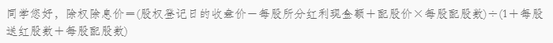

- 发行市场
  background-color:: #978626
  collapsed:: true
	- 优先股
	  background-color:: #533e7d
	  没有选举权和被选举权，对公司重大事件也无投票权（像债券）
		- 筹资风险较小的筹资方式：发行普通股 #优序融资理论
		- 优先股在“剩余索取权”上优先，但没有选举权和被选举权，一般不能参加公司的经营决策，优先股拥有投票权是有条件的
		- 后配股：又称劣后股、后分股，指剩余资产的清偿权及股息的分配权劣后于普通股的股票
		- 混合股：在股息分配上比普通股具有优先权而在剩余财产分配上处于劣后地位的股票
		- > 普通股一般权力：公司经营决策参与权、盈余分配权、剩余资产分配权、优先认股权等
	- 股票的发行方式
		- 公开间接发行
		- 不公开直接发行
	- 首次公开发行（IPO折价）
	  background-color:: #533e7d
	  collapsed:: true
	  √首次公开发行是拟上市公司首次在证券市场公开发行股票募集资金并上市的行为。
	  √通常，首次公开发行是发行人在满足必须具备的条件，并经证券监管机构审核、核准或注册后，通过证券承
	  销机构面向社会公众公开发行股票并在证券交易所上市的过程。
		- 赢家诅咒
		  √市场存在着两种投资者，即掌握信息的投资者和未学握信息的投资者，如果股票首次公开发行出现了定价过高的现象，则学握信息的投资者不会认购，该股票会完全出售给那些未学握信息的投资者，这时未掌握信息的投资者将会在首次公开发行中获得负的收益，即出现“赢家的诅咒”现象。
		  √当未掌握信息的投资者意识到这一点时，就合理性地退出发行市场。由于股票发行需要不断地吸引川那些未学握信息投资者的投资，因此在股票首次公开发行时必须以低价方式进行，以便为那些未掌握信息的投资者提供一定的收益，以弥补他们由于投资偏差而造成的损失，从而使得以后的股票发行能够顺利地进行。
		- 信号假说
		  √市场中存在着业绩较好和业绩较差的两类公司，而投资者却难以区分这两类公司。业绩较好的公司为了与业绩较差的公司有所区别，通过P0低定价向市场中的投资者发出一种信号，使投资者认为该公司拥有美好的发展前景，在首次
		  公开发行中将采取低价发行的形式，公司在上市后的第二次公开发行中将有能力通过高价发行来弥补在首次公开低价发行中所造成的损失。而业绩较差的公司则不会这么做，因为若开始采取低价发行的方式，在随后的发行中将得不到补偿（因为业绩较差而难以在以后的发行中以高价发行）。
		- 从众假说
		  折价发行吸引第一批投资者，诱发从众效应，使发行能够顺利进行
		- 投资银行垄断假说
		  投行通过折价发行，可以提高承销活成功的概率，降低风险。
		- 所有权分散假说
		  公司管理层通过低价发行使投资者对股票产生过度需求，稀释股权，而公司管理层就可以继续控制公司，为自己谋取利益。
		- [[行为金融学]]
	- A股和H股溢价谜
	  background-color:: #533e7d
		- 背景：
		  √在国际资本市场上，双重上市是非常普遍的现象，是由于双重上市有提高上市公司的知名度，改善公司
		  股权结构，增加股本流动性等益处。自1993年青岛啤酒在上海证券交易所和香港联交所同时上市，越来
		  越多的优秀企业，诸如中国石以、中国平安、招商银行、工商银行等选择在AH股票市场同时上市。
		  √但境内资本市场，也就是A股市场上的股票价格会高于H股市场上的价格，这也成为中国股票市场之谜
		- 原因：
			- 信息不对称假说
			  ◆由于语言、会计准则、地理距离、文化等方面的差别，境外投资者在获取并评价A股公司信息方面
			  更加困难，对H股的预期回报率要高于境内投资者对A股的预期回报率
			  风险差异假说
			  ◆境内的股票市场投机氛围更浓，所以境内投资者可以承受较高的股票价格
			- 流动性假说
			  ◆股票的价格除了反映一家公司的基本面之外，还会存在流动性溢价，即流动性更强的公司的价格更
			  高。由于H股的流动性较差，故相对于A股存在价格折让
			  差别需求假说
			  ◆境外投资者的投资机会更多，，而境内投资者的可选择投资品种较少，从而使得A股价格存在溢价
		- 建议
		  √一是要加强内地投资的观念引导，整顿股票市场投资风气，建立良好的信息互通体系。避免大量的散户
		  投资者追涨杀跌，造成股价的大幅波动，这也会极大的减少交易量，根据先前的学者研究，股价的大幅
		  波动会显著影响交易量。
		  √二是政府要完善相关体制，不光要加大沪港通、深港通的开放，还有积极引导优秀的企业在AH股票市
		  场双重上市，同时也要鼓励在香港上市的优秀公司，例如近些年的腾讯、美团等回归A股上市，使两地
		  市场趋于平衡。
		  √三是要充分发挥内地市场上，投资机构的作用，鼓励私募公募，社保基金，保险公司等机构入市，形成
		  价值投资者的风气，减少大量散户在市场上的交易，使股票市场进入一个良性的发展阶段。
- 二级市场
  background-color:: #978626
  collapsed:: true
	- 交易所：有组织、固定地点、集中交易，要满足上市条件；
		- 流程：开户、委托、成交、过户
	- 场外市场：凡是不再证券交易所内进行的证券交易都属于这个市场
	- 股票的信用交易
	  background-color:: #533e7d
	  投资者通过交付保证金取得经纪人信用而进行的交易。如证券抵押贷款、证券再抵押贷款
		- 形式：
		  background-color:: #497d46
		  保证金卖空：融券交易（借入股票出售，以后买入同种股票归还）；
		  保证金买空：融资交易
		- 初始保证金比例（首付）、维持保证金比例
		- > 卖空必须以升标或零加标为规则（即只能在价格升势中卖空），这是为了防止股票崩盘，维持市场稳定
		- 借入证券的来源：
		  * 经纪人或另一家经纪商的存货
		  * 愿意出借证券的机构投资者如养老基金的财产
		  * 由经纪商以街名持有的或开立保证金账户的其他投资者的证券
- [[股价]]
  background-color:: #978626
- 证券投资基金
  background-color:: #978626
  collapsed:: true
	- 契约型基金（信托型）：签订契约，通过发行受益凭证来筹集资金
	- 公司型基金：发行股份筹集资金，专门进行证券投资，以营利为目的
	  * 法律依据不同
	  * 投资者地位不同
	  * 基金期限不同
	  * 资金性质不同
	- 封闭型基金：发行完毕和规定的期限内形成封闭状态，资本总额及发行份额固定不变
	- 开放型基金：可以申购和赎回
	  * 期限、规模、交易方式、价格形成方式、投资策略、激励约束机制不同
	- 成长型：激进的基金
	- 收入型：相对保守
	- 基金资产净值计算：
	  background-color:: #533e7d
		- 基金资产净值=基金资产总值-基金总负债（包括借入资金、对管理人应付报酬）
		- 基金单位资产净值=基金资产净值/已售出的基金份额总数（某一时间每份基金份额实际代表的价值，是衡量基金业绩的主要指标和影响基金价格的重要因素）
	- 金额费率法：
	  background-color:: #533e7d
	  费用=认购金额*费率
	  总金额-费用=净认购金额
	  认购份数=净认购金额/价格
	- 净额费率法：
	  background-color:: #533e7d
	  净认购金额*（1+费率）=认购金额
	  认购份数=净认购金额/价格
	- 基金绩效评价：
	  background-color:: #533e7d
		- 夏普比率
		  （基于CML）$$SR=\frac{R_i-R_f}{\sigma_i}$$
		  表示投资组合总风险的回报，同时考虑系统风险和非系统性风险，反映基金经理市场调整和分散非系统性风险的能力
		- 特雷诺比率
		  （基于SML）$$TR=\frac{R_i-R_f}{\beta_i}$$
		  表示基金承受每单位系统性风险所获取的风险收益的大小，**隐含非系统性风险已经全部被消除的假设**，反映经理的市场调整能力
		- 詹森指数
		  （基于CML）$$\alpha_i=R_i-[R_f+\beta(R_m-R_f)]$$
		  表示基金的投资组合收益率与相同系统性风险下的市场投资组合收益率之间的差异，**隐含非系统性风险全部被分散掉的假设**，反映基金经理投资组合收益有多少超额收益
		- 信息比率
		  （基于SML）$$IFR=\alpha_p/\beta_i$$
		  测算每单位非系统性风险带来的非常规收益
		- M^2测度
		  改进的夏普比率。反映资产组合同相应的无风险资产混合以达到同市场组合具有相同的风险水平时，混合组合的收益高出市场收益的大小
		  $$M^2=R_p^*-R_f$$
		  $$R_p^*=r_P^*-r_f=\sigma_mS_p$$
		  $$R_M=r_m-r_f$$
		  $$\rightarrow M^2=\sigma_mS_p-\frac{r_m-r_f}{\sigma_m}*\sigma_m=(S_p-S_m)*\sigma_m$$
- 股利政策
  background-color:: #978626
	- 股利发放的形式：
	  background-color:: #533e7d
		- 现金股利
		- 股票股利（送股）
		  与现金股利相比，股票股利没有影响公司的利润、资产，只是增加了公司发行在外的股数。股价会下降（不考虑信息，否则不一定）。与股票拆分相比，股票股利增加了公司的股本，减少了留存收益
		- 股票回购
		  一是在市场上公布购回自己公司的股票；二是要约收购；三是公司直接向大股东洽谈
	- 股利支付程序：
	  background-color:: #533e7d
		- 宣布日：公告股利支付情况
		- 股权登记日：有权领取本期股利的股东资格等级截止日，登记日之后买入股票没有股利
		- 除息日：股利与股价分离
		- 股利支付日：正式发放股利，它在股权登记日和除息日之后
- 