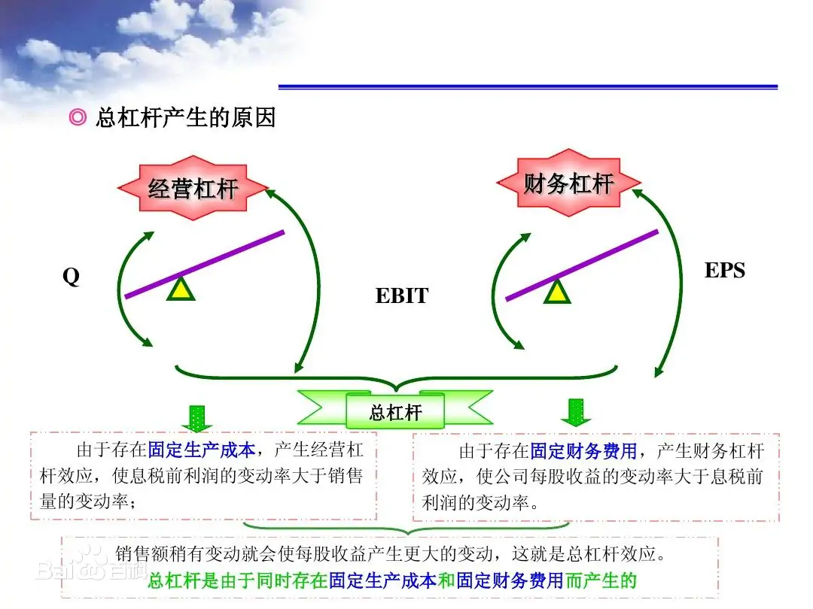

- 维持日常经营状况所需要的资本
- **经营杠杆系数**=息税前利润的变动率/销量的变动率=M/(M-F)
	- 1．在固定成本不变的情况下，经营杠杆系数说明了销售额增长(或减少)所引起的营业利润增长(或减少)的幅度；
	- 2．在固定成本不变的情况下，销售额越大，经营杠杆系数越小，经营风险也就越小；反之，销售额越小，经营杠杆系数越大，经营风险也就越大。
	- 3．在销售额处于[盈亏临界点]前的阶段，经营杠杆系数随销售额的增加而递增：在销售额处于盈亏临界点后的阶段，经营杠杆系数随销售额的增加而递减：当销售额达到盈亏临界点时，经营杠杆系数趋近于无穷大，此时经营风险趋近于无穷大；
	- 4．在销售收入一定的情况下，影响经营杠杆的因素主要是固定成本和[变动成本](https://baike.baidu.com/item/%E5%8F%98%E5%8A%A8%E6%88%90%E6%9C%AC?fromModule=lemma_inlink)的金额。[固定成本](https://baike.baidu.com/item/%E5%9B%BA%E5%AE%9A%E6%88%90%E6%9C%AC?fromModule=lemma_inlink)或变动成本加大都会引起经营杠杆系数增加。这些研究结果说明，在固定成本一定的情况下，公司应采取多种方式增加销售额，这样利润就会以经营杠杆系数的倍数增加，从而赢得“正杠杆利益”。否则，一旦销售额减少时，利润会下降的更快，形成“负杠杆利益”。
- **财务杠杆系数**=每股收益的变动率/息税前利润的变动率**=(△EPS/EPS)/(△EBIT/EBIT)**=EBIT/(EBIT-I-DP/(1-T))
- **联合杠杆系数**=每股收益变化的百分比/营业收入变化的百分比=(EBIT+F)/[EBIT-I-PD/(1-T)]
  id:: 62e7764d-2200-472a-a3c1-f69ce11c0305
- 经营杠杆效应的含义:
  由于存在固定经营成本，销售量的较小变动会引起息税前利润较大的变动的现象。
- 财务杠杆效应的含义:
  在某一固定的债务与权益融资结构下由于息税前利润的变动引起每股收益产生更大变动程度的现象被称为财务杠杆效应。
- 联合杠杆效应
  是指由于固定经营成本和固定融资[费用]的存在，导致普通股每股收益变动率大于销售变动率的现象。
- 
- 应收账款管理
  background-color:: #978626
	- 信用期限
	  background-color:: #533e7d
		- 信用期过短：不足以吸引顾客，销售额下降
		- 信用期过长：机会成本、管理成本、坏账成本
	- 现金折扣政策：
	  background-color:: #533e7d
		- 5/10：10天内付款，享受5%的价格优惠，只需支付95%
		- n/30：此时付款无优惠【可视为应收账款周转天数】
		- 放弃折扣的年成本=折扣率/（1-折扣率）*360/（信用期-折扣期）
	- 最佳应收账款存量的确认：
	  background-color:: #533e7d
		- $$\Delta Y=\Delta NI-\Delta OC-\Delta BC$$
		- 净收益、增量利润、增量机会成本、增量坏账成本
		- 分析过程：
			- 1. 分析应收账款周转率降低之后年均应收账款的变化
			  2. 净利润的增加：销售收入的增加，成本的减少（注意销售收入的增加部分只有变动成本没有固定成本）
			  3. 增量机会成本：应收账款增加所需多付出的成本。周转效率下降所增加的应收账款（对应原本的销售成本率）（需要把固定成本计算进来）；信用条件放宽而增加的收入所对应的应收账款的增加（不增加固定成本，只对应销售-变动成本）
			  4. 增量坏账成本的来源：应收账款的增加
- 最优现金返回线
  background-color:: #978626
	- 原理：确定现金持有量上限和下限以及最优现金返回线，现金持有量达到上限则买入证券，达到下限则卖出证券，使其达到最优现金返回线。现金持有量在上下限之间不采取行动计算公式：下限L受企业每日的最低现金需要量、管理人员风险承受倾向等因素的影响
	- 最优现金返回线：$$R＝(\frac{3bδ^2}{4i})^{\frac{1}{3}}＋L$$
	- 其中b表示每次有价证券的固定转换成本；i表示有价证券的日利息率；δ表示预期每日现金余额变化的标准差；L是下限
	- 上限H＝3R－2L
	- 应用条件：现金未来的需求总量和收支不可预测
- 商业票据年化成本APR
  background-color:: #978626