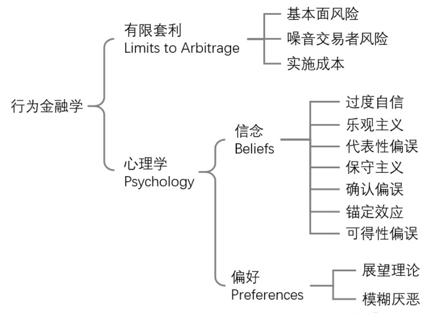

- ipo折价
  collapsed:: true
	- 过度反应
	  IPO利好，对股票过度需求，市场热销但不会持久。发行人为了弥补理性的承销商和机构投资者
	- 反应不足
	  过度相信自己的信息，对公共信息反应不足。新消息与私人信息一致时会强化认知。IPO利好引发市场热销，高估股票，大量买进，产生折价
	- 自我归因
	  对自己有利的事情归因于自我能力，对自己不利事情归因于外界因素。利好消息：验证自我能力，自信加强；利空消息：自信不会减弱
- 
- 有效市场假说认为，市场的有效性有三个层次：第一层，所有投资者都是完全理性的，信息可以迅速传播，所有资产都被合理定价，没有套利空间；第二层，即使有少数不理性的投资者，由于他们的价格服从随机游走，相互抵消，不影响市场资产的合理定价；第三层，即使不理性的投资者的投资不能相互抵消，也有足够多理性的套利者会通过套利使市场价格回复合理定价。而行为金融学认为这一套利行为是有限的。主要原因是套利有三个方面的成本：一是交易手续、税收等摩擦费用、发现市场不合理定价的成本、价格恢复时间过长而无法承受的风险；二是基本面风险，套利者要承担负面消息使价格持续下跌的风险；三是噪声交易者风险，套利者要承担过多的噪声交易者形成羊群效应使价格持续下跌的风险。所以无法充分套利
- 行为金融学的第二个支柱就是心理学。他分析了人们的各种系统性认知偏差，这影响了人们的信念和做风险决策的偏好。
  偏差的信念包括：过度自信、乐观主义、保守主义、代表性偏差**⌈忽略先验概率、忽略样本大小⌋**、确认偏差、锚定效应、可得性偏差
  偏好包括：期望理论和模糊厌恶**⌈**在不确定性的博弈中，人们厌恶结果未知的情况**⌋**
- 理性：
  background-color:: #978626
	- 投资者并非理性。过度自信、后悔/骄傲、熟悉性、过度反应、保守性、收益或损失后承担的风险
- 独立的理性偏差：
  background-color:: #978626
	- 理性偏差不能相互抵消，仍然有很强的相关性
- 套利：
  background-color:: #978626
	- 实践中，套利受到的各种限制将影响套利的有效性，套利充满风险而作用有限
- 主要市场异常行为：
  background-color:: #978626
	- 动量效应&反转效应：
	  background-color:: #533e7d
	  正反馈机制、过度自信与处置效应
	  * 处置效应：为了避免后悔，人们倾向于继续持有出现资本损失而急于变现具有资本利得的股票
	- 心理账户：
	  人们根据资金来源不同把资产划分为不同账户，并具有不同的风险偏好
	- 日历效应：
	  background-color:: #533e7d
	  * 一月效应
	  * 周末效应
	- 规模效应（小公司效应）：
	  background-color:: #533e7d
	  小公司收益率更高
	- 羊群效应：
	  background-color:: #533e7d
	- 正反馈机制：就是追涨杀跌的行为模式。原因包括：羊群效应，预期的自实现，制度因素，套利者的推动
	  还有一些人认为，市场参与者完全消化新信息需要一段时间，因此市场价格完全包含所有信息也需要一段时间。消息灵通者就可以从中获利