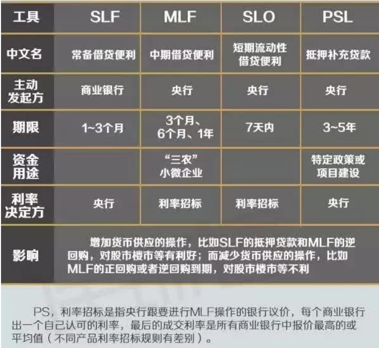

- 央行为了某一政策目标而控制和调节货币供应量和信贷规模的措施的总称
- 货币政策目标
  background-color:: #978626
  collapsed:: true
	- 总目标
	  background-color:: #533e7d
		- 稳定物价、充分就业（失业率在可接受范围内）、经济增长、国际收支平衡
		- 稳定物价与充分就业的矛盾：要保持充分就业就必须扩大生产规模，增加货币供应量，导致物价上涨。要降低物价上涨率，就要紧缩银根，压缩生产规模，提高失业率。
		- 经济增长与国际收支平衡之间的矛盾：经济增长，就业增加，收入提高，贸易顺差。而贸易逆差，必须压缩国内需求，而紧缩的货币金融政策又会引发经济增长缓慢和衰退，失业增加
		- 物价稳定和经济增长的矛盾：有争议！有的人认为通胀可以作为经济增长的推动力；也有人认为除非保持物价稳定，否则不能实现持续的经济增长。从根本上讲，经济的增长和发展，为保持物价稳定提供了物质基础，两者在根本上是统一的。
	- 中间目标
	  background-color:: #533e7d
		- 选择标准：可控性（通过货币政策工具的运用，能进行有效的控制和调节）、可测性（概念清晰，能迅速准确地收集到相关指标）、相关性、抗干扰性
		- 操作目标【近期目标】：为央行提供直接、连续的反馈信息。操作目标由可以反映银行体系扩大放款能力的**超额准备金**和作为银行体系的存款扩张和货币创造的**基础货币**（流通中现金+银行存款准备金）组成。而超二准备金受制于商业银行体系的房贷意愿和财务情况，所以我们 将基础货币作为货币政策操作目标
		- 效果指标【远期目标】：进一步为央行提供反馈信息，衡量货币政策达到最终目标的效果。效果指标由利率和货币供应量组成。虽然利率可以由央行的再贴现率进行控制，但是再贴现政策具有被动性且利率具有很强的经济内生性，抗干扰能力弱，因此我们选择货币供应量作为中间目标。
			- 随着我国利率市场化进程的稳步推进，在未来利率作为中间目标的重要性可能也将日益凸显。我国目前的货币政策中间目标为：M2+社会融资规模
- 货币政策工具
  background-color:: #978626
  collapsed:: true
	- 代表宏观性措施的一般性政策工具
	  background-color:: #533e7d
		- 再贴现
		  央行直接调整或制定对合格票据的贴现利率来干预和影响市场利率以及货币市场的供给和需求，从而调节市场货币供应量。贴现率实质上就是央行向商业银行的放宽利率。再贴现政策主要有三点局限性：
		  * 央行处于被动地位，不能强迫或阻止商业银行向央行申请再贴现，商业银行还可以通过其他渠道获得资金，因此往往达不到预期的效果
		  * 效果不明显。由于货币市场的发展和效率提高，商业银行对央行贴现窗口的依赖性大大降低
		  * 再贴现政策缺乏弹性。央行若经常调整贴现率，会引起市场利率的经常性波动，使得企业或商业银行无所适从。
		- 存款准备金
		  主要有两点影响：
		  * 对货币乘数的影响。准备率越高，银行存款创造信用的规模就越小。
		  * 对超额准备金的影响。表现为决定超额准备的多少，影响商业银行创造信用的基础。
		  负面影响：
		  * 央行难以确定调整准备率的时机和调整幅度
		  * 许多商业银行也难以迅速调整准备金以附合变动了的法定限额。商业银行一般只保留少量超额准备金，若干周转不足的银行，或被迫在市价疲软的情况下大量抛售有价证券会处于困境
		- 公开市场操作
		  央行在证券市场上公开买卖各种政府证券，以控制货币供应量以及影响利率水平的行为。公开市场政策主要是通过影响商业银行体系的持有准备金来进一步影响商业银行信贷量的扩大和收缩。基本操作：央行根据市场经济形式的发展，在需要缩紧银根时卖出证券，买入货币；在需要增加市场流动性时，买入证券，卖出货币。
		  优点：
		  * 通过公开市场操作可以左右整个银行体系的基础货币量
		  * 央行有主动权，可以根据不同情况和需要主动出击
		  * 可以适时适量进行调节，更为灵活
		  * 可以根据金融市场信息不断调整业务，迅速反方向操作，改正错误，产生连续性效果，使社会对货币政策不易做出激烈反应
		  注意：
		  * 公开市场业务对货币供应量和利率的影响，应根据买卖净值而定，以免央行同一天买卖业务出现抵消
		  * 对利率变动和结构的影响，应根据证券的种类而定，若买卖证券的种类不同，则可能改变利率的期限结构和影响社会的投资结构。
		  * 央行购入证券后固然会增加商业银行的准备金，但不一定会扩张信贷规模
		  * 要产生预期的效果，前提是必须有一个高度发达的证券市场，并且是具有相当的深度、广度和弹性的市场。央行也必须持有相当的库存证券才能开展业务。
	- 代表微观性措施的选择性工具
	  background-color:: #533e7d
		- 间接信用控制工具：作用过程是间接的，要通过市场供求关系或资产组合的调整途径才能实现。主要有这几种：
		  * 优惠利率。央行对国家重点发展经济部门制定较低的贴现利率或放宽利率
		  * 证券保证金比率：央行通过购买证券的贷款规定法定保证金比率，以控制对证券市场的信贷量
		  * 消费信用管制：对消费者信贷量进行控制，抑制过度消费需求或刺激消费
		  * 预缴进口保证金制度：机制进口过分增长，要求进口商预缴进口商品总值的一定比率的外汇存于央行，以减少外汇流失。
		  * 房地产信贷管制：央行限制银行或金融机构对房地产的放款。阻止房地产投机
		- 直接信用管制：
		  央行以行政命令的方式，直接对银行放款或接受存款的数量进行控制。
		  * 贷款量的最高限额
		  * 存款利率的最高限额
		- 道义劝告
	- 新型货币政策工具
	  background-color:: #533e7d
		- SLF，常备信贷便利。期限：1-3月，对象：政策性银行及全国性商业银行
		  * 金融机构主动申请
		  * 一对一交易，针对性强
		  * 覆盖面广，覆盖存款金融机构
		- MLF，中期借贷便利。期限3个月，对象商业银行和政策性银行，类似常备信贷便利，区别在于抵押补充贷款时间比较长而且到期后可能会重新约定利率重新借款。
		  > 有专家认为，由SLF向MLF的转变，标志着央行货币政策正从数量型为主转向价格型为主
		- 
- 货币政策传导机制
  background-color:: #978626
	- 凯恩斯学派：
	  background-color:: #533e7d
	  核心是利率
	  M↑——r↓——I↑——E↑——Y↑（E是总支出，Y是总收入）
	- 货币主义学派：
	  background-color:: #533e7d
	  利率不起作用，货币供应量主导
	  M↑——E↑——Y↑
	  货币供应量增加会降低利率，但这是暂时的。利率下降会刺激投资，使产出和收入增加，货币需求又会增加，利率又开始回升。所以货币政策通过倾向供给量的变化影响社会的总支出和总收入水平。
	  > 货币学派的两个共性
	  * 货币供给增加的调节方式是通过调节实际货币余额，这不同于凯恩斯用利率间接控制总需求。这里实际货币余额与预计货币需求等价。
	  * 货币市场均衡
	- 汇率渠道：
	  background-color:: #533e7d
	  货币供应量增加，利率上升，本币贬值，汇率上升，净出口增加，总产出增加。
	- 股价渠道：
	  background-color:: #533e7d
	  * 托宾q渠道：（q是企业市场价值与企业重置资本之比）。货币供应量增加，股价上升，q上升，投资增加，总产出增加
	  * 消费的财富效应理论：货币供应量增加，股价上升，财富上升，消费增加，总产出上升
	- 信贷渠道
	  background-color:: #533e7d
	  强调金融市场不对称信息的货币政策传导机制。克服了传统的利率效应对货币政策如何影响长期资产成本的解释并不能令人满意的缺点。
	  * 银行贷款渠道：货币供应量增加，银行存款上升，银行贷款上升，投资增加，总产出增加
	  * 资产负债表渠道：
	  货币供应量增加，股价上升，净值增加，贷款上升，投资增加，产出增加
	  货币供应量增加，利率下降，现金流增加，贷款增加，投资增加，产出增加
	  货币供应量增加，预期通胀上升，企业负债减少，净值增加，贷款上升，投资增加
- 货币政策效果
  background-color:: #978626
  collapsed:: true
	- 认识时滞、决策时滞、货币政策外部时滞
	- 合理预期因素的影响。社会经济单位和个人根据货币政策工具的变化对未来经济形势进行预测
	- 客观经济条件的变化以及政治因素或外来因素的影响。
	- 相机抉择：
	  background-color:: #533e7d
	  市场经济并无自动调节或稳定的趋向，而且货币政策的时滞是短暂的。央行应会同财政部门依照集体经济情况的变动，运用不同工具和采取相应措施来稳定金融经济
	- 单一规则：
	  background-color:: #533e7d
	  长期一贯维持固定的或稳定的货币增长率。经济繁荣时，固定货币增长率低于货币需求增长率，自动收缩经济过度膨胀；经济不景气，需求不足时，固定货币增长率高于货币需求增长率，自动刺激经济恢复。同时，由于时滞和判断失误等因素，相机决策可能成为经济不稳定的制造者。
	- > **泰勒规则**：标准泰勒（Taylor）规则是常用的简单[货币政策]规则之一，由泰勒于1993年针对美国的实际数据提出。[泰勒规则]描述了[短期利率]如何针对[通胀率]和产出变化调整的准则。
	  联邦基金利率指标=均衡实际联邦基金利率+通胀率+0.5*通胀缺口+0.5*产出缺口
	  * 通胀缺口：实际通胀减去目标通胀
	  * 产出缺口：实际产出超过潜在产出产生的缺口（两者用于衡量通胀发生的可能性）